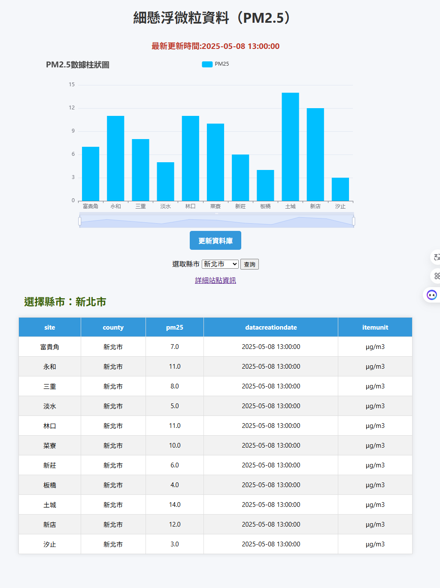
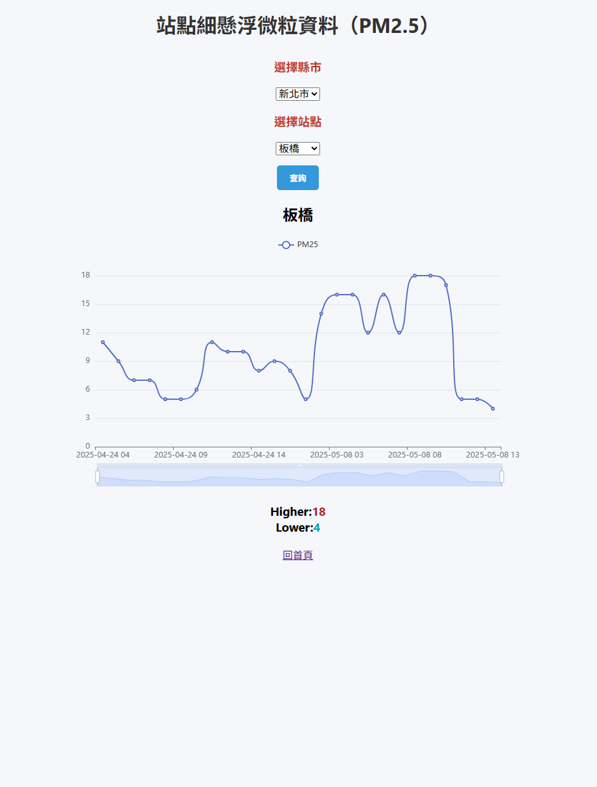
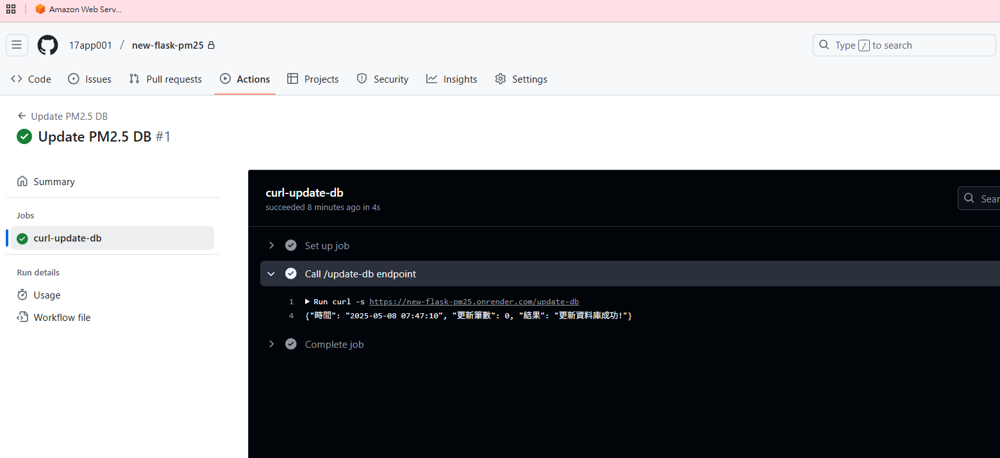

# 🌫 PM2.5 資料視覺化平台

使用 Python + Flask 製作的 PM2.5 圖表網站，整合政府開放資料 API，並使用 MySQL 儲存歷史紀錄。支援縣市、站點查詢，並使用 ECharts 呈現動態圖表。




---

## 🔧 功能特色

- 🏞 縣市、站點下拉選單即時查詢
- 📈 使用 ECharts 呈現歷史趨勢
- 🔄 API 資料自動更新至 MySQL
- ☁️ 可部署至 [Render](https://render.com/) 雲端平台
- 🔐 使用 `.env` 管理敏感資訊

---




## 📁 專案結構

├── app.py # Flask 主程式  
├── pm25.py # 資料庫與 API 邏輯  
├── templates/ # HTML 模板  
│ ├── index.html  
│ └── pm25-site.html  
├── static/  
│ └── style.css  
├── requirements.txt # 套件清單  
└── .env # 資料庫設定（勿上傳）  


## 📁 安裝套件
```bash
flask
pandas
pymysql
python-dotenv
gunicorn

```

---

## 🚀 快速啟動（本地端）

```bash
git clone https://github.com/your-user/pm25-visual-flask.git
cd pm25-visual-flask

python -m venv venv
source venv/bin/activate    # Windows: venv\Scripts\activate

pip install -r requirements.txt

```
---

## 建立 .env 檔：
- DB_HOST=127.0.0.1
- DB_PORT=3306
- DB_USER=root
- DB_PASSWORD=
- DB_NAME=demo

- python app.py

## 上傳到Render跟啟動

- gunicorn app:app


# 🌐 GitHub Actions 自動化排程：自動更新 PM2.5 資料庫

## 🎯 教學目標

利用 GitHub Actions 定時呼叫部署於 Render 的 Flask 應用程式 `/update-db` 路由，自動更新 PM2.5 資料庫。

---

## ✅ 前置條件

- 已部署 Flask 網站至 Render，並包含 `/update-db` API 路由
- GitHub repository 中包含 Flask 原始碼
- 熟悉 `.env` 與 `update_db()` 資料更新邏輯

---

## 📁 建立 GitHub Actions 工作流程

### 📌 步驟 1：建立資料夾

在專案根目錄下建立 `.github/workflows/` 資料夾：

```bash
mkdir -p .github/workflows
```

## 步驟 2：建立工作流程檔案
### 建立 pm25-update.yml 並加入以下內容：
```bash
name: Update PM2.5 DB

on:
  schedule:
    - cron: '30 15 * * *'  # 每天 23:30 台灣時間 (UTC+8)
  workflow_dispatch:       # 可手動執行

jobs:
  curl-update-db:
    runs-on: ubuntu-latest
    steps:
      - name: Call /update-db endpoint
        run: curl -s https://new-flask-pm25.onrender.com/update-db
```


##　Cron 設定補充
### 　調度時間（UTC）	台灣時間對應	說明
- 30 15 * * *	每日 23:30	自動更新資料庫

## 成功執行畫面
GitHub Actions 執行記錄中會看到輸出如下：
- Update PM2.5 DB #1
- 🕒 {"時間": "2025-05-08 23:30:05", "更新筆數": 12, "結果": "更新資料庫成功!"}



## 附註：修正時間格式為台灣時間
``` bash
from datetime import datetime, timedelta
nowtime = (datetime.utcnow() + timedelta(hours=8)).strftime("%Y-%m-%d %H:%M:%S")
```
